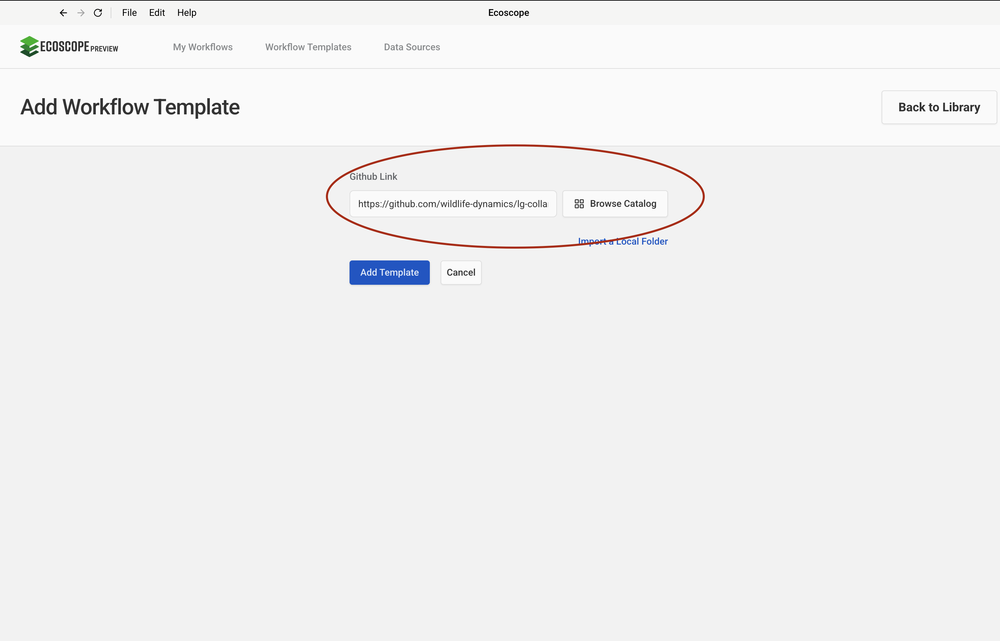
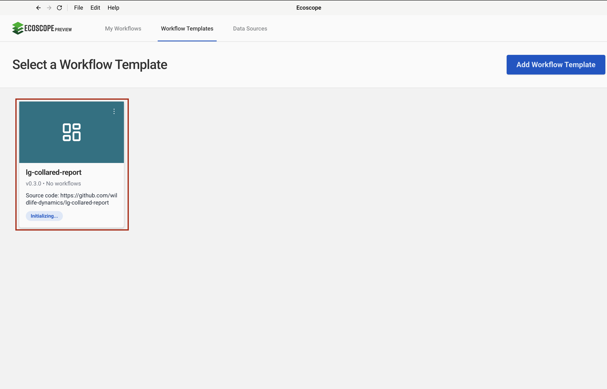
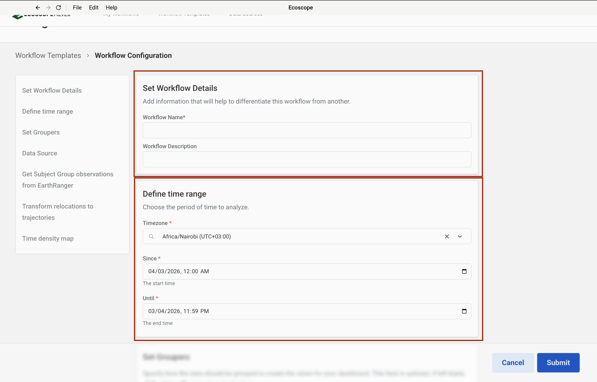
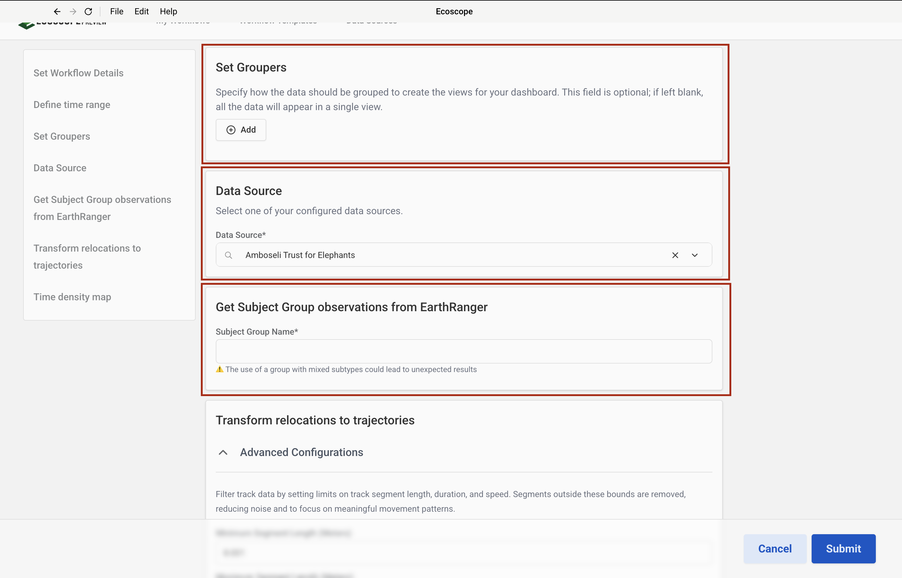
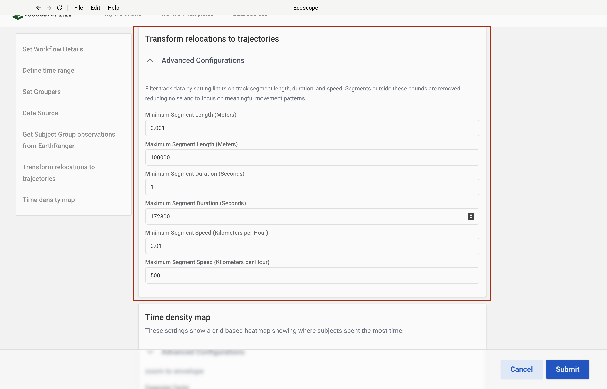
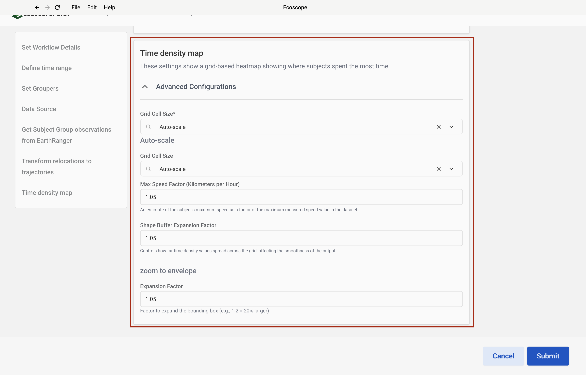

# LG Collared Report Workflow — User Guide

This guide walks you through configuring and running the LG Collared Report Workflow, which generates a movement analysis report for GPS-collared lions in the Amboseli ecosystem sourced from EarthRanger.

---

## Overview

The workflow produces, for each collared subject (or group):

- A **Home Range map** (Elliptical Time Density contours at 50–99th percentiles)
- A **Subject Tracks map** (movement corridors for the analysis period)
- **Speed and distance summary statistics** per subject
- A **Word document report** (`.docx`) with a cover page and one section per subject
- An **interactive widget dashboard**

---

## Prerequisites

Before running the workflow, ensure you have:

- Access to an **EarthRanger** instance with a configured data source
- The **Subject Group Name** of the collared lions exactly as it appears in EarthRanger

> The three spatial boundary files (group ranch boundaries, conflict hotspot areas, and protected areas) are downloaded automatically from Dropbox — no local copies are required.

---

## Step-by-Step Configuration

### Step 1 — Add an EarthRanger Connection

Navigate to **Data Sources** and add a new EarthRanger connection. Fill in:

- **Data Source Name** — a label to identify this connection
- **EarthRanger URL** — your instance URL (e.g. `your-site.pamdas.org`)
- **EarthRanger Username** and **EarthRanger Password**

> Credentials are not validated at setup time. Any authentication errors will appear when the workflow runs.


---

### Step 2 — Add the Workflow Template

In the workflow runner, go to **Workflow Templates** and click **Add Workflow Template**. Paste the GitHub repository URL into the **Github Link** field:

```
https://github.com/wildlife-dynamics/lg-collared-report.git
```

Then click **Add Template**.



---

### Step 3 — Select the Workflow

After the template is added, it appears in the **Workflow Templates** list as **lg-collared-report**. Click it to open the workflow configuration form.

> The card may show **Initializing…** briefly while the environment is set up.



---

### Step 4 — Configure Workflow Details and Time Range

The configuration form opens with two sections at the top.

**Set Workflow Details**

| Field | Description |
|-------|-------------|
| Workflow Name | A short name to identify this run |
| Workflow Description | Optional notes about the run (e.g. date range or subject group) |

**Define time range**

| Field | Description |
|-------|-------------|
| Timezone | Select the local timezone (e.g. `Africa/Nairobi UTC+03:00`) |
| Since | Start date and time of the analysis period |
| Until | End date and time of the analysis period |

All movement data, trajectories, and home ranges are computed within this window.



---

### Step 5 — Set Groupers, Data Source, and Subject Group

Scroll down to configure three sections.

**Set Groupers** *(optional)*

Groupers control how the workflow partitions subjects for per-group outputs. If left blank, all data appears in a single view. Click **Add** to add a grouper. Available options:

| Grouper | Effect |
|---------|--------|
| Subject Name | One map, metrics, and report section per individual lion |
| Subject Sex | Aggregate outputs by sex (M / F) |
| Subject Subtype | Aggregate outputs by subtype |

**Data Source**

Select the EarthRanger data source configured in Step 1 from the **Data Source** dropdown.

**Get Subject Group observations from EarthRanger**

Enter the **Subject Group Name** exactly as it appears in EarthRanger (case-sensitive). This is the group of collared lions to include in the report.

> Using a subject group that contains mixed subtypes may produce unexpected results.



---

### Step 6 — Set the Trajectory Filter

Expand **Advanced Configurations** under **Transform relocations to trajectories** to set the segment filter. These parameters remove GPS noise and biologically unrealistic movements before trajectory analysis.

| Field | Default | Description |
|-------|---------|-------------|
| Minimum Segment Length (m) | `0.001` | Discard segments shorter than this distance |
| Maximum Segment Length (m) | `100000` | Discard segments longer than this distance |
| Minimum Segment Duration (s) | `1` | Discard segments shorter than this duration |
| Maximum Segment Duration (s) | `172800` | Discard segments longer than this duration (48 hours) |
| Minimum Segment Speed (km/h) | `0.01` | Discard segments below this average speed |
| Maximum Segment Speed (km/h) | `500` | Discard segments above this average speed |

Adjust these values to suit the movement characteristics of your collared lions.



---

### Step 7 — Configure Time Density Map and Zoom to Envelope

Expand **Advanced Configurations** under **Time density map** to control the home range computation, and configure the map zoom settings below it.

**Time density map**

| Field | Default | Description |
|-------|---------|-------------|
| Grid Cell Size | `Auto-scale` | Cell size of the density raster — Auto-scale derives it from data density |
| Max Speed Factor | `1.05` | Estimate of the subject's maximum speed as a factor of the maximum measured speed in the dataset |
| Shape Buffer Expansion Factor | `1.05` | Controls how far time density values spread across the grid, affecting the smoothness of the output |

**Zoom to envelope**

| Field | Default | Description |
|-------|---------|-------------|
| Expansion Factor | `1.05` | Factor to expand the bounding box around the data extent before zooming (e.g. `1.2` = 20% larger) |

A value of `1.0` gives a tight fit to the data; increasing it adds padding around the map extent.



---

## Running the Workflow

Once all parameters are configured, click **Submit**. The runner will:

1. Pull movement data from EarthRanger for the specified subject group and time range.
2. Download the static boundary files (group ranches, conflict hotspots, protected areas).
3. Convert observations to relocations and build trajectory segments.
4. Compute Elliptical Time Density home ranges per group.
5. Generate the Home Range and Subject Tracks maps (interactive HTML + PNG screenshots).
6. Calculate speed and distance summary statistics per subject.
7. Render the Word report (cover page + per-subject sections) and assemble the dashboard.
8. Save all outputs to the directory specified by `ECOSCOPE_WORKFLOWS_RESULTS`.

---

## Output Files

All outputs are written to `$ECOSCOPE_WORKFLOWS_RESULTS/`:

| File | Description |
|------|-------------|
| `relocations.geoparquet` | Cleaned GPS fix locations |
| `trajectories.geoparquet` | Trajectory segments with speed and distance |
| `<group>_homerange.html` | Interactive ETD home range map per group |
| `<group>_tracks.html` | Interactive subject tracks map per group |
| `<group>_homerange.png` | Screenshot of the home range map (2× resolution) |
| `<group>_tracks.png` | Screenshot of the tracks map (2× resolution) |
| `<group>_summary.csv` | Speed and distance summary table with totals row |
| `lg_cover_page.docx` | Rendered report cover page |
| `<group>.docx` | Per-grouper report section |
| Merged report `.docx` | Final combined Word report |
