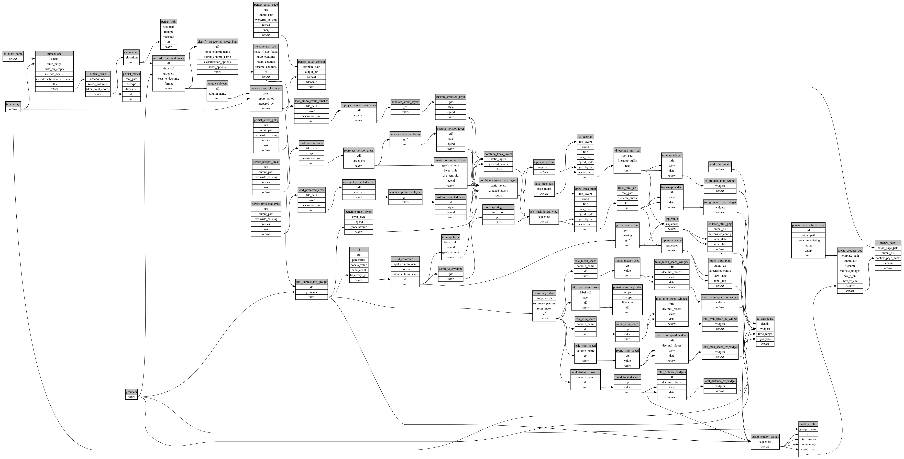

```
# AUTOGENERATED BY ECOSCOPE-WORKFLOWS; see fingerprint in README.md for details

```

```yaml
# fingerprint:
artifacts_sha256_basic: a77a05e5154844b770c3c21e5cb7a12d8dbdaeb30e80bb8a35476416dd832b09
artifacts_sha256_strict: 14ca1685077ad04b48623fdb5f96a8e43e6c9506cc20f0dcb3827b3a7deeb8bf
installed_requirements:
- channel: https://repo.prefix.dev/ecoscope-workflows/
  name: ecoscope-workflows-core
  version: {version: ==0.22.17}
- channel: https://repo.prefix.dev/ecoscope-workflows/
  name: ecoscope-workflows-ext-ecoscope
  version: {version: ==0.22.17}
- channel: https://repo.prefix.dev/ecoscope-workflows-custom/
  name: ecoscope-workflows-ext-custom
  version: {version: ==0.0.40}
- channel: https://repo.prefix.dev/ecoscope-workflows-custom/
  name: ecoscope-workflows-ext-ste
  version: {version: ==0.0.18}
- channel: https://repo.prefix.dev/ecoscope-workflows-custom/
  name: ecoscope-workflows-ext-mnc
  version: {version: ==0.0.7}
- channel: https://repo.prefix.dev/ecoscope-workflows-custom/
  name: ecoscope-workflows-ext-big-life
  version: {version: ==0.0.8}
- channel: https://repo.prefix.dev/ecoscope-workflows-custom/
  name: ecoscope-workflows-ext-lion-guardians
  version: {version: ==0.0.6}
params_sha256: 44a3f9573e6237d27d10b46b43b09d70737257addd8a546e376b359c4a5ff42f
spec_sha256: 17538fd79bd7775f5969937a0192d037dd4f74204feb915a6ea05110fe2ca0a9

```

# ecoscope-workflows-collared-report-workflow


