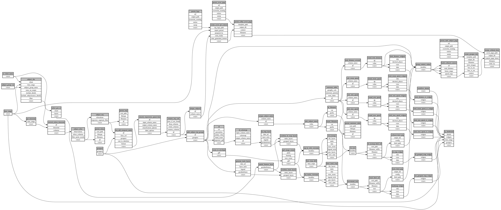

```
# AUTOGENERATED BY ECOSCOPE-WORKFLOWS; see fingerprint in README.md for details

```

```yaml
# fingerprint:
artifacts_sha256_basic: c08b91a3c992b8ac68ec6fbc00cf39424c35188d2f8ca235dae394faa90cd6ac
artifacts_sha256_strict: 3956d0bd374d443a74894076697e1491ec0f30d4a665fb373bf2e5783aaac69f
installed_requirements:
- channel: https://repo.prefix.dev/ecoscope-workflows/
  name: ecoscope-platform
  version: {version: ==2.15.1}
- channel: https://repo.prefix.dev/ecoscope-workflows-custom/
  name: ecoscope-workflows-ext-custom
  version: {version: ==0.1.0rc14}
- channel: https://repo.prefix.dev/ecoscope-workflows-custom/
  name: ecoscope-workflows-ext-ste
  version: {version: ==0.0.0rc1}
- channel: https://repo.prefix.dev/ecoscope-workflows-custom/
  name: ecoscope-workflows-ext-lion-guardians
  version: {version: ==0.0.0rc1}
- channel: conda-forge
  name: pydeck
  version: {version: ==0.9.2}
- channel: conda-forge
  name: opentelemetry-sdk
  version: {version: ==1.44.0}
params_sha256: 56b00b20f5dc27763cf00619400cbff34e2755c5214525e3b7949e89d0d01f91
spec_sha256: 7020b5d2dc14cd623679e7d0068f84ce8dfc85027e93f32a1b2a040e627b6cc4

```

# ecoscope-workflows-collared-report-workflow


